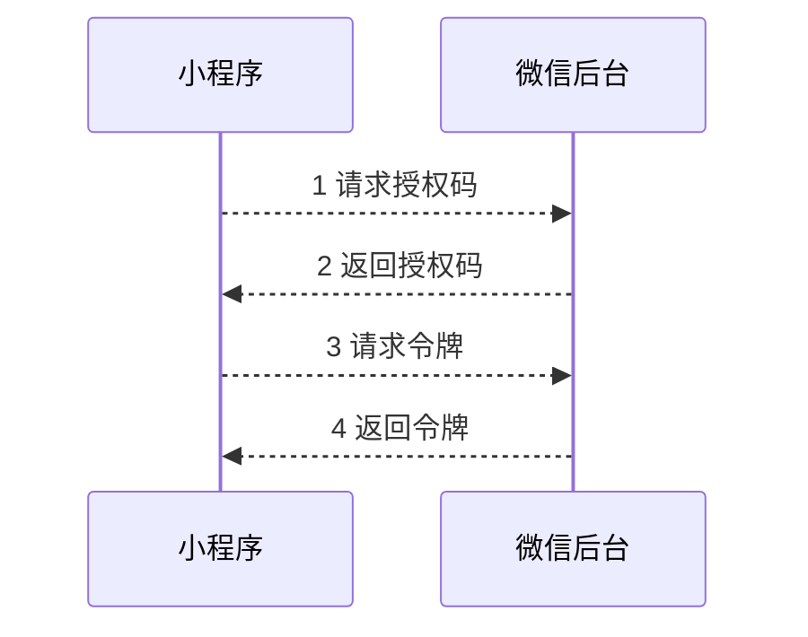

---
title: oauth2.0 
tags: auth
categories: web
mermaid: true
---   

## 1 简述
```
OAuth 就是一种授权机制。数据的所有者告诉系统，
同意授权第三方应用进入系统，获取这些数据。
系统从而产生一个短期的进入令牌（token），用来代替密码，供第三方应用使用
向第三方应用颁发令牌
``` 

+ 授权码（authorization-code） 

``` 
最常用的流程，安全性也最高，适用于那些有后端的 Web 应用。
授权码通过前端传送，令牌则是储存在后端，而且所有与资源服务器的通信都在后端完成。
这样的前后端分离，可以避免令牌泄漏 
```
 
-----
 
    


| 序号 | 地址 | 说明 |
| ---- | ---- | ---- |
|  1    | https://b.com/oauth/authorize?response_type=code&client_id=CLIENT_ID&redirect_uri=CALLBACK_URL&scope=read    | 返回授权码的命名,客户端编码,回调地址,申请权限 |
|  2    | https://a.com/callback?code=AUTHORIZATION_CODE     |  回调地址,返回授权码的命名,授权码    |
|  3    | https://b.com/oauth/token?client_id=CLIENT_ID&client_secret=CLIENT_SECRET&grant_type=authorization_code&code=AUTHORIZATION_CODE&redirect_uri=CALLBACK_URL     | 客户端编码,客户端密码(一般后台存储),授权类型,授权码,回调地址     |
|  4    | https://a.com/callback    |  返回结构,{ "access_token":"令牌/授权码",  "token_type":"bearer",  "expires_in":2592000,  "refresh_token":"更新令牌码",  "scope":"权限",  "uid":100101,  "info":{...} }    |

+ 隐藏式（implicit）
``` 纯前端应用,安全要求不高的场景,浏览器关掉，令牌就失效``` 

+ 密码式（password）
``` 把用户名和密码，直接告诉该应用。该应用就使用你的密码，申请令牌``` 

+ 客户端凭证（client credentials）
```  没有前端的命令行应用，即在命令行下请求令牌``` 


## 2 功能
+ 令牌获取: 参考上面
+ 令牌使用: Authorization的值
+ 令牌更新: access_token返回过期之后,refresh_token去获取更新

## 3 令牌与密码的差别
+ 令牌是短期的,用户无法修改
+ 令牌是可撤销的
+ 令牌是有权限范围的,密码的其中一部分权限,参考微信的手机号码登录

## 4 参考链接
+ [OAuth 2.0 认证框架](http://www.rfcreader.com/#rfc6749)
+ [OAuth 2.0 的一个简单解释](http://www.ruanyifeng.com/blog/2019/04/oauth_design.html)
+ [OAuth 2.0 的四种方式](http://www.ruanyifeng.com/blog/2019/04/oauth-grant-types.html)
